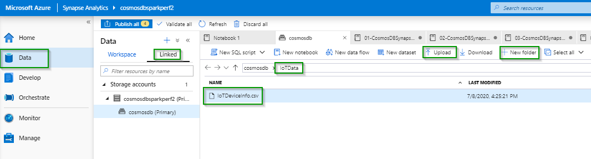

# IoT Anomaly Detection leveraging Azure Synapse Link for Azure Cosmos DB
The hypothetical scenario is Power Plant where signals from steam turbines are being analyzed and Anomalous signals are detected. You will ingest streaming and batch IoT data into Azure Cosmos DB using Azure Synapse Spark, perform Joins and aggregations using Azure Synapse Link and perform anomaly detection using Azure Cognitive Services on Spark (MMLSpark).

## Environment setup
Please make sure that you followed the pre-reqs of the main [README](../README.md) file. After that, please execute the steps below in the same order that they are presented here.
1. Using the Data / Linked tab of your Synapse workspace, create IoTData folder within the root directory of the storage account that is attached to the Synapse workspace. Upload to this folder the below csv files that are placed under the IoTData dir of this repo. 
*     a. IoTSignals.csv
*     b. IoTDeviceInfo.csv

* Note: IoTSignals.csv has the sample data generated through the [01-CosmosDBSynapseStreamIngestion] (IoT/spark-notebooks/pyspark/01-CosmosDBSynapseStreamIngestion.ipynb) notebook. You can either use the data present in the IoTSignals.csv file or generate your own data using the 01-CosmosDBSynapseStreamIngestion notebook.

2.  Using the Azure Portal, go to the Access Control (IAM) tab of the storage account associated with Synapse workspace, click on the +Add and Add a role assignment and add yourself to the Data Contributor role. This is needed for any spark metadata operations such as creating databases and tables using the Azure Synapse Spark Pool.

3. Using the Azure Portal, go to Data Explorer of your the Azure Cosmos DB Account and create a database called CosmosDBIoTDemo. 

4. In the same Data Explorer, create two Analytical Store enabled containers: IoTSignals and IoTDeviceInfo. In the portal interface, the container-id is the container name. Change the Throughput to Autoscale and set the max limit to 4,000. Please click [here](https://review.docs.microsoft.com/en-us/azure/cosmos-db/configure-synapse-link?branch=release-build-cosmosdb#create-analytical-ttl) for details on how to enable Analytical storage on Cosmos DB containers.
    * Use /id as the Partition key for both the containers
    * Please make sure that Analytical store is enabled for both the containers

5. In your Azure Synapse workspace, go to the Manage / Linked Services tab and create a linked service called CosmosDBIoTDemo pointing to the Cosmos DB database that was created in step 3 above. Please click [here](https://review.docs.microsoft.com/en-us/azure/synapse-analytics/synapse-link/how-to-connect-synapse-link-cosmos-db?branch=release-build-synapse#connect-an-azure-cosmos-db-database-to-a-synapse-workspace) for more details on creating Synapse linked service pointing to Cosmos DB. 
